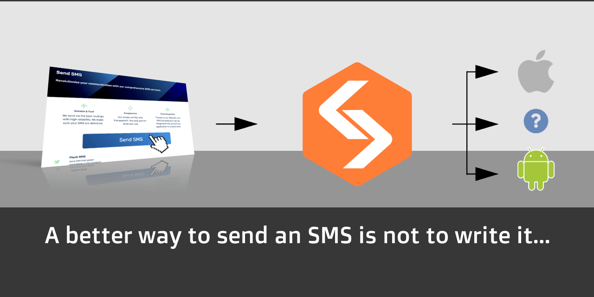

# SMS Href assets

Licensed under
a [Creative Commons Attribution 4.0 International (CC BY 4.0)](https://creativecommons.org/licenses/by/4.0/) license.

### Logo

[SVG](sms-href_logo.svg) or [PNG](sms-href_logo.png)

---

## Variants

### Logo (transparent chevron)

[SVG](sms-href_logo_transparent_chevron.svg) or [PNG](sms-href_logo_transparent_chevron.png)

### Logo (background outline WHITE)

[SVG](sms-href_logo_bg_outline_white.svg) or [PNG](sms-href_logo_bg_outline_white.png)

### Logo (background outline BLACK)

[SVG](sms-href_logo_bg_outline_black.svg) or [PNG](sms-href_logo_bg_outline_black.png)

---

## Banners

### Social preview

